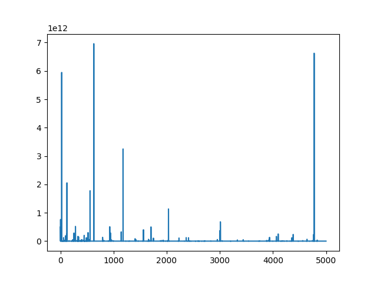
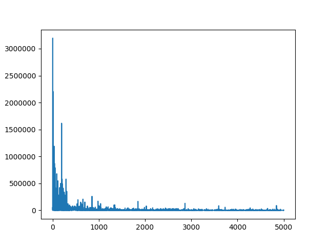

## Weekly Report
links here: \
[Jan 25th - Jan 31st](https://github.com/BellaMENG/bellameng.github.io/blob/master/_pages/paperlist.md#jan-25th---jan-31st)

## GitHub Code
[Source Code](https://github.com/BellaMENG/Bitcoin-Blockchain-DataMining)

## Dataset
[MIT dataset](https://senseable2015-6.mit.edu/bitcoin/)

This page contains processed bitcoin data of first 508241 blocks.

## VLDB
Subgraphs and Communities: [Vertex Priority Based Butterfly Counting for Large-scale Bipartite Networks](http://www.vldb.org/pvldb/vol12/p1139-wang.pdf)\
Graph Analytics: [Efficient Algorithms for Densest Subgraph Discovery](http://www.vldb.org/pvldb/vol12/p1719-fang.pdf)

## Network

[Network structure and minimum degree](https://ucilnica.fri.uni-lj.si/pluginfile.php/1212/course/section/1202/Seidman%20-%20Network%20structure%20and%20minimum%20degree%2C%201983.pdf)

## Bitcoin

[Bitcoin: A Peer-to-Peer Electronic Cash System](https://bitcoin.org/bitcoin.pdf)\
[An Analysis of Anonymity in the Bitcoin System](https://arxiv.org/abs/1107.4524)\
[The Unreasonable Effectiveness of Address Clustering](https://arxiv.org/pdf/1605.06369.pdf)\
[A Bayesian approach to identify Bitcoin users](https://journals.plos.org/plosone/article?id=10.1371/journal.pone.0207000)\
[Quantitative Analysis of the Full Bitcoin Transaction Graph](https://eprint.iacr.org/2012/584.pdf)\
[Bitcoin Transaction Graph Analysis](https://people.csail.mit.edu/spillai/data/papers/bitcoin-transaction-graph-analysis.pdf)\
[Inferring the Interplay of Network Structure and Market Effects in Bitcoin](https://arxiv.org/abs/1412.4042)\
[Do the Rich Get Richer? An Empirical Analysis of the Bitcoin Transaction Network](https://journals.plos.org/plosone/article?id=10.1371/journal.pone.0086197)\
[BlockSci: Design and Applications of a Blockchain Analysis Platform](https://arxiv.org/abs/1709.02489)\
[Oracle Presentation: Analyzing Blockchain and Bitcoin Transaction Data as Graph](https://www.youtube.com/watch?v=w8OEVobyhFE)\
[An Evaluation of Bitcoin Address Classification based on Transaction History Summarization](https://arxiv.org/abs/1903.07994)\
[Breaking Bad: De-Anonymising Entity Types on the Bitcoin Blockchain Using Supervised Machine Learning](https://core.ac.uk/download/pdf/143481278.pdf)\
[There’s No Free Lunch, Even Using Bitcoin: Tracking the Popularity and Profits of Virtual Currency Scams](https://mvasek.com/static/papers/vasekfc15.pdf)\
[When the cookie meets the blockchain: Privacy risks of web payments via cryptocurrencies](https://arxiv.org/pdf/1708.04748.pdf)

## Subgraph matching

[In-Memory Subgraph Matching: An In-depth Study](https://dl.acm.org/doi/10.1145/3318464.3380581)\
[Efficient Subgraph Matching on Billion Node Graphs](https://arxiv.org/abs/1205.6691)\
[Taming Verification Hardness: An Efficient Algorithm for Testing Subgraph Isomorphism](https://dl.acm.org/doi/10.14778/1453856.1453899)\
[Managing and Mining Large Graphs: Systems and Implementations](http://www.cs.albany.edu/~jhh/courses/readings/shao.sigmod12.graph_dbs.pdf)

## Graph Clustering

[Introduction of Graph Clustering - Springer](https://link.springer.com/referenceworkentry/10.1007%2F978-0-387-30164-8_348#:~:text=Definition,edge%20weights%20or%20edge%20distances.)\
[An Algorithm for Subgraph Isomorphism](https://dl.acm.org/doi/10.1145/321921.321925)\
[Clustering and Community Detection in Directed Networks: A Survey](https://arxiv.org/pdf/1308.0971.pdf)

## Series of Research of [Damiano Di Francesco Maesa](https://scholar.google.com/citations?hl=en&user=9u78kdMAAAAJ&view_op=list_works&sortby=pubdate)

2020 - [Leveraging the Users Graph and Trustful Transactions for the Analysis of Bitcoin Price](https://ieeexplore.ieee.org/abstract/document/9138785)\
2019 - [The bow tie structure of the Bitcoin users graph](https://link.springer.com/article/10.1007/s41109-019-0163-y)\
2018 - [Data Driven Analysis of Bitcoin Properties: Exploiting the Users Graph](https://www.researchgate.net/profile/Damiano_Maesa/publication/320026355_Data-driven_analysis_of_Bitcoin_properties_exploiting_the_users_graph/links/5ac4c4feaca27218eabcb770/Data-driven-analysis-of-Bitcoin-properties-exploiting-the-users-graph.pdf)

## Weekly Reports

### Jan 25th - Jan 31st
- Processed the dataset and stored the data into CSR format. [Code](https://github.com/BellaMENG/Bitcoin-Blockchain-DataMining)
- Functions to implement: according to the original bitcoin blockchain data, form a adjacency matrix, where each element on the matrix represent an edge between corresponding address i and address j. According to i and j, unique ids for the edges are generated and generate a file that contains timestamp information and transaction amount information of that edge.
- Implementing the following algorithms on the graph:\
https://arxiv.org/pdf/1308.0971.pdf Page 43-45\
[The unreasonable effectiveness of address clustering](https://arxiv.org/pdf/1605.06369.pdf), 2 heuristics: Common spending and One-time change\
Implement another datastructure to represent the transaction network of Blockchain and link it to the address transaction network

### Feb 1st - Feb 7th
- Implemented pagerank algorithm and implementing other clustring algorithm\
- Collected and preprocessed bitcoin exchange addresses
- Collected and preprocessed the timestamp data of the edge list
- Read references: https://people.csail.mit.edu/jshun/graph.shtml#clustering
- Implementing Algorithms according to this survey paper: [Community detection in graphs](https://arxiv.org/pdf/0906.0612.pdf)

### Feb 8th - Feb 19th
- Paper: [There’s No Free Lunch, Even Using Bitcoin: Tracking the Popularity and Profits of Virtual Currency Scams](https://mvasek.com/static/papers/vasekfc15.pdf)
- Collected the 5k addresses with the largest pagerank values
- Running statistical results about the 5k addresses on balances, number of transactions and tags/labels

According to the walletexplorer tag packs, 30 out of 5000 selected addresses has tags:
{"gambling": 10, "exchange": 13, "service": 4, "scam": 1, "miner": 1, "market": 1}

Number of unique clusters among the 5k addresses (according to the UTXO and other heuristics) is 2441.\
Number of clusters in the blockchain that contains 508241 blocks is 278534077.\
Number of addresses in PageRank output: 370269747.\
Number of addresses in the blockchain: 426868262

### Feb 22nd - Feb 26th
Read some paper regarding different clustering algorithms and Bitcoin heuristics and clustering.

[Analysis of the Bitcoin blockchain: socio-economic factors behind the adoption](https://epjdatascience.springeropen.com/articles/10.1140/epjds/s13688-018-0170-8)\
This paper is more social science focused. It analysed the correlation between geographical information and the adoption of Bitcoin in thoses locations. The methodology they utilized was to track the IP addresses by joining the Bitcoin network. They then matched the IP addresses to countries. This paper presented some interesting results including the adoption rate in some countries, the scale of transactions in different countries, and other interesting results.

[Mining Information on Bitcoin Network Data](https://ieeexplore.ieee.org/stamp/stamp.jsp?tp=&arnumber=8276874)\
This paper simply summarized the number of bitcoin transactions per block, trends transaction amount and some other general easily obtained information about the Bitcoin network. In addition, the researchers also collected IP addresses information by participating into the P2P Bitcoin network.

I revisited some paper including the original Bitcoin paper, BlockSci paper, and several papers explaining and investigating Bitcoin heuristics.

[A Fistful of Bitcoins: Characterizing Payments Among fMen with No Names](https://cseweb.ucsd.edu/~smeiklejohn/files/imc13.pdf)\
In this paper, the two heuristics were formally defined and implemented: 1) all addresses that appeared in the same transaction as inputs are controled by the same entity; and 2) the change addresses that exist in output of transactions also belong to the same entity as the inputs of the transactions.

[When the cookie meets the blockchain: Privacy risks of web payments via cryptocurrencies](https://arxiv.org/abs/1708.04748)\
To read in detail. In this paper, it mentioned how to detect CoinJoin transactions, which are transactions that will not follow the previously mentioned heuristics. It also investigated in other privacy-related issues with some merchants that take Bitcoin as a payment method.

In the BlockSci paper, it mentioned that we could used spectral clustering techniques to improve the imperfection because of the inherent feature of heuristics and anonymity of Bitcoin.

[On spectral clustering: Analysis and an algorithm](http://citeseer.ist.psu.edu/viewdoc/summary?doi=10.1.1.33.1501)

https://arxiv.org/pdf/1308.0971.pdf: \
This is a summary of clustering and community detection algorithms in directed graphs.
Broadly speaking, there are two trends to clustering directed graphs: either we convert the graphs to undirected graphs, or we cluster them as directed graphs. For the Bitcoin transaction graph, it is possible that we can still get good clustering result even if we do not consider the direction of transactions. Because for example, if we are considering bitcoin addresses belong to the same Bitcoin Exchange, their coins always transfer within a short time period to another address after they collected it (to protect privacy and their money collected, according to my understanding).

Or we can treat the graphs as directed graphs. There are several types of clustering methods, including spectral clustering, cut-based and random-walk based method. For the cut-based method, a Laplacian matrix for directed graphs were proposed and usually used for the previously mentioned purpose.

[Laplacians and the Cheeger Inequality for Directed Graphs](https://link.springer.com/article/10.1007/s00026-005-0237-z)\
[A Random Walks View of Spectral Segmentation (2001)](http://citeseer.ist.psu.edu/viewdoc/summary?doi=10.1.1.33.1501)

- A few papers tracked the network data by joining the bitcoin network as a p2p node. They can then collect IP addresses and map the IP addresses to geo-locations
- To do: get the most active user in the graph network and extract the condensed network
- Figure out what are the basic concepts/gists behind different clustering methods on directed graphs and how to apply them
- How to make sense of the weighted graph

[Deanonymizing Bitcoin Transactions: an Investigative Study on Large-scale Graph Clustering](https://yashpatel5400.github.io/files/deanonymization.pdf)
- In this thesis paper, it mentioned several clustering models that can be used to Bitcoin transaction graph to cluster, including k-means, spectral clustering, and DBSCAN.
- The problem with the results shown are the following: first, the dataset was relatively old and it didn't specifically mention the scope of its data. According to the code he published GitHub, he used Blocksci tool to obtain and parse the data, which I assume should be up to 2017. Secondly, he mentioned eight heuristics   of clustering Bitcoin addresses, but when applying the clustering algorithms, he didn't utilize any of the heuristics mentioned, but purely applied the algorithms without alternations. Thirdly, all of the clustering methods were evaluated mostly according to the objective scores, which are purity, NMI and F-score
- Ways to improve some of the algorithms is that to incorporate some of Bitcoin's inherent natures to serve as distance or other parameters in the algorithms. At the same time, now we have more ground truth variables, it may help improve the clustering results.

[Deanonymization and linkability of cryptocurrency transactions based on network analysis](https://ieeexplore.ieee.org/stamp/stamp.jsp?tp=&arnumber=8806723)
[Deanonymisation of clients in Bitcoin P2P network](https://arxiv.org/pdf/1405.7418.pdf)
- Both of them mentioned how to trace entry nodes of transactions by tracing the IP address. The first paper mentioned to use a heuristic or intuition that, if a node relays a transaction to the experiment node quickly, it is likely to be the entry node. (My understanding: entry nodes do not need to verify the transaction)

[On spectral clustering: analysis and an algorithm](https://ai.stanford.edu/~ang/papers/nips01-spectral.pdf) 2001
- a detailed Mathematical paper about spectral clustering algorithm.

TODO:
- bibliography
- Extract ground truth tags using Blocksci and process the data to desired format
- Implement algorithms: k-means, spectral clustering and DBSCAN
